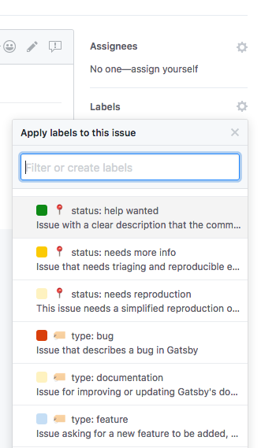

## O que são classificadores de issues?

Classificadores de issues é uma ferramenta no GitHub usada para agrupar issues em uma ou mais categorias.

[Veja as labels do Gatsby e suas definições](https://github.com/gatsbyjs/gatsby/issues/labels)

## Por que usar o classificador de issues?

Gatsby é um projeto bem ativo e diariamente tem novas issues abertas. Classificando as issues ajuda a identificar:

- boas issues para novos contruibuidores trabalharem nelas
- reportar e confirmar bugs
- solicitar novas features
- issues duplicadas
- issues que estão paradas ou bloqueadas

## Quem pode classificar as issues?

Qualquer um que seja membro do [Time de Mantenedores do Gatsby](https://github.com/orgs/gatsbyjs/teams/maintainers) pode classificar as issues.

Você pode receber um convite do time quando seu Pull Request for mergeado no projeto do Gatsby. Veja a lista de [`precisa de ajuda`](https://github.com/gatsbyjs/gatsby/labels/%F0%9F%93%8D%20status%3A%20help%20wanted) das issues e o [O Guia de Como Contribuir](/contributing/how-to-contribute/) para começar.

**NOTA:** Se você já teve um pull resquest mergeado e _não_ foi convidado pelo time de mantenedores, por favor vá para [o dashboard](https://store.gatsbyjs.org/) e solicite um código de desconto. Você deve receber um convite do time - _e pegue de graça seu Gatsby swag!_ Se não funcionar, por favor envie um email para team@gatsbyjs.com e nós conseguiremos um convite para você.

## Como classificar uma issue

Idealmente, toda issue deve ter um só `tipo:` de classificador aplicado a ela. Opcionalmente uma label `status:` ou mais labels, também podem ser aplicadas.

Antes de continuar, familiarize-se com as [labels do Gatsby e suas definições](https://github.com/gatsbyjs/gatsby/issues/labels)

As etapas princiapis para classificar uma issue são:

- Leia a issue
- Escolha as labels que aplicam para aquela issue
- E é isso - sente e relaxe, e talvez curta por um momento a satisfação de ter feito um bom trabalho.

O resto deste documento vai descrever como escolher as labels corretas para uma issue.

### Encontre uma issue que você esteja interessado

Comece com a [lista de issues do Gatsby](https://github.com/gatsbyjs/gatsby/issues) e procure até você encontrar uma nova issue que chame a sua atenção. Alternativamente, você pode ver a [lista de issues não classificadas](https://github.com/gatsbyjs/gatsby/issues?q=is%3Aopen+is%3Aissue+no%3Alabel).

### Leia a issue

Leia a issue e qualquer comentários para entender do que ela se trata.

### Escolha o `tipo:` label

Escolha o tipo de classificador do dropdown de _labels_ que estará do lado direito da issue.

Você também pode checar as [descrições das labels](https://github.com/gatsbyjs/gatsby/issues/labels) para entender melhor cada uma.

O tipo mais comum de issue é `tipo: questão ou discussão`, normalmente você pode aplicar à issues que são open-ended ou não tem uma próxima etapa.

É OK mudar o tipo de issue assim que mais informações fiquem disponíveis. O que inicia um `tipo: questão ou discussão`, pode mais tarde mudar para `tipo: bug`.

Mudar as labels é rápido e facilmente reversível, então não se preocupe em aplicar uma label "errada".

Escolha o `tipo:` de label apropriado e siga para o próximo passo.

### Escolha um `status:` (opcional)

Veja sobre [`status:` labels (e suas descrições)](https://github.com/gatsbyjs/gatsby/issues/labels), e se nenhum deles forem aplicável à issue, adicione um novo se necessário.

Exemplos de aplicação de `status:` devem ser:

- Uma issue que dependa de uma dependência externa, e esse dependência seja mudada, ela deve ser classificada como `status: bloqueada`

- Uma issue com uma descrição clara de como ser resolvida pode ser classificada como `status: precisa de ajuda`.

- Uma issue que falta informações para ajudar o autor da issue a resolver, pode ser classificada como `status: precisa de mais informação`

- Uma issue descrevendo um bug, sem a clara informação de como reproduzir o bug, pode ser classificada como : `status: precisa de reprodução`

- Uma issue descrevendo um bug com as etapas de reprodução do mesmo _e_ você rodou o código localmente e viu o erro, pode ser classificada como `status: confirmado`

### Esolha outros classificadores

Existem outros tipos de classificadores que podem às vezes ser aplicados a uma issue. Aqui são alguns exemplos de quando usá-los:

- `boa primeira issue` pode ser usada quando uma issue é pequena, e a sua resolução pode ser feita por alguém que não tenha um conhecimento profundo de Gatsby e como ele funciona. Essas issues são particulamente adequadas para pessoes que estão fazendo suas primeiras contribuições open-source.

- `obsoleto` pode ser usado em uma issue onde o autor não respondeu às perguntas para mais informações nos últimos 20 dias.

### Terminar

E é isso, você terminou! Você pode terminar o seu dia ou voltar para a primeira etapa, para classificar outra issue.

### Conclusão

Classificar issues é uma boa maneira de ajudar no projeto do Gatsby independente do seu nível de experiência.
