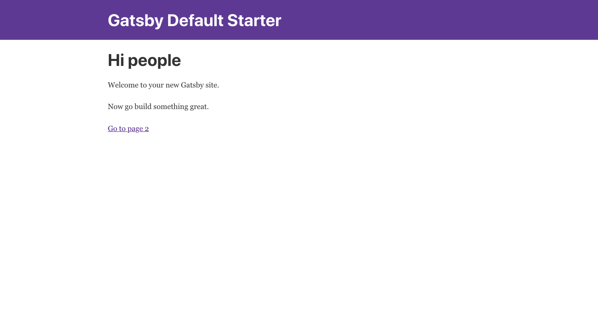

Esse guia explica como publicar e hospedar seu próximo _site_ Gatsby no [Netlify](https://www.netlify.com/).

Netlify é uma opção excelente para publicar _sites_ Gatsby. Netlify é uma plataforma unificada que automatiza seu código para criar _sites_ e aplicativos _web_ de fácil manutenção e alta performance. Eles fornecem publicação contínua (Acionadas por construção no Git); um inteligente CDN global; DNS completo (incluindo domínios customizados); HTTPS automatizado; Aceleração de _assets_; e muito mais.

Eles fornecem um nível gratuito que inclui projetos pessoais e comerciais ilimitados, HTTPS, publicação contínua de repositórios públicos ou privados e mais.

## Configuração de hospedagem

Existem dois meios de hospedar o seu _site_:

1. [Configuração de repositório do Git](#configuração-de-repositório-do-git)

2. [Enviando a pasta do _site_](#enviando-a-pasta-do-site)

### Configuração de repositório do Git

Netlify tem suporte embutido para [Github](https://github.com/), [GitLab](https://about.gitlab.com/) e [Bitbucket](https://bitbucket.org/). Essa abordagem permite reverter para versões antigas do _site_ sempre que você desejar. Você ainda ganha a habilidade de publicar novamente o _site_ enviando o código ao respectivo repositório, sem a necessidade de fazer a construção e o envio de forma manual toda vez que você realizar alterações, sendo seu repositório público ou privado.

Agora, entre no netlify e você vai ver um botão `New site from git` (Novo site a partir do git) no canto superior direito da sua tela. Clique nele e conecte com o mesmo provedor git que você usa para hospedar o seu _site_ e permita ao Netlify usar sua conta. Escolha o repositório do seu _site_ e você será levado as configurações de publicação com as opções abaixo.

- _Branch to Deploy_ (Branch para publicação): Você pode especificar uma _branch_ para ser monitorada. Quando você fizer o envio para aquela _branch_ específica, somente então o Netlify irá construir e publicar o _site_. A _branch_ padrão é a `master`.
- _Build Command_ (Comando para construção): Você pode especificar o comando que você quer que o Netlify rode quando você enviar para a _branch_ acima. O comando padrão é `npm run build`.
- _Publish directory_ (Diretório de publicação): Você pode especificar qual pasta o Netlify deve usar para hospedar seu _website_, exemplo, _public_, _dist_, _build_. O diretório padrão é o `public`.
- Configurações avançadas de construção: Se o _site_ necessita de variáveis de ambiente para construção, você especificá-las clicando em _Show advanced_ (Mostrar avançado) e então no botão _New variable_ (Nova variável). 

Clique no botão _Deploy site_ (Publicar site) e o Netlify vai começar o processo de construção e publicação que foi especificado por você. Você pode ir na aba _Deploys_ (Publicados) e ver o processo se desenrolar no _Deploy log_ (Log de publicação). Após alguns momentos, você vai receber o URL em que seu _site_ foi publicado, exemplo `nome-aleatorio.netlify.com`

### Enviando a pasta do site

Existe também a opção de enviar o seu _site_ para o Netlify sem utilizar git.

Para a [_build_ de produção](/docs/glossary#build), você vai precisar rodar o comando `gatsby build`; Gatsby vai gerar o _site_ de produção na pasta `public`. Durante o processo de construção, o CSS, JavaScript, HTML e as imagens vão ser otimizados e colocados dentro dessa pasta.

```shell
gatsby build
```

Quando a construção estiver completa, você estará pronto para enviar seu site ao Netlify. Vá em [Netlify](https://app.netlify.com/) e faça o _login_ ou se cadastre usando qualquer método. Após realizar o _login_ com sucesso, você verá a mensagem mostrada abaixo:

```text
    Want to deploy a new site without connecting to Git?
          Drag and drop your site folder here
    (Você quer publicar um novo site sem conectar ao Git?
          Arraste e solte a pasta do seu site aqui)
```

Para iniciar o processo de publicação, você precisa apenas arrastar e soltar a pasta `public` sobre a área acima no _site_ do Netlify. Netlify vai criar um novo _site_ com um nome aleatório, e então começar a enviar e hospedar os arquivos da aplicação. Após alguns momentos, ele vai lhe disponibilizar um URL para o _site_, exemplo `nome-aleatorio.netlify.com`



## Publicação contínua

Agora que o seu _site_ está conectado ao seu repositório, o Netlify vai fazer a publicação sempre que você enviar alterações para o seu repositório Git.

## Configuração de domínio

Na aba _Overview_ (Visão geral) do seu _site_, você pode ir em _Domain Settings_ (Configurações de domínio). Ao adicionar um domínio personalizado e definir o registro `CNAME` como o URL do projeto Netlify nas configurações do seu provedor de DNS, você deve ser capaz de ver o projeto do Netlify na URL de seu domínio.

## Outros recursos

- [Um guia passo a passo: Gatbsy no Netlify](https://www.netlify.com/blog/2016/02/24/a-step-by-step-guide-gatsby-on-netlify/)
- Mais [postagens de blog no Gatsby + Netlify](/blog/tags/netlify)
- [Gatsby Netlify CMS](/packages/gatsby-plugin-netlify-cms)
- [Starter CMS do Gatsby + Netlify](https://github.com/netlify-templates/gatsby-starter-netlify-cms)
