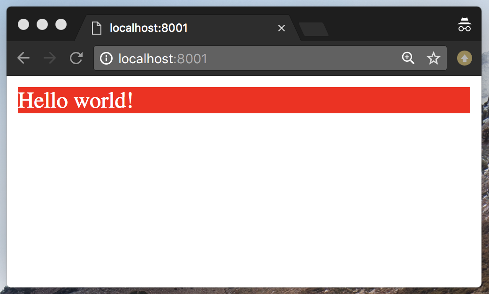

Tradicionalmente, os sites são estilizados utilizando arquivos CSS globais.

As regras de escopo global são declaradas em arquivos `.css` externos, [Especificidade CSS](https://developer.mozilla.org/pt-BR/docs/Web/CSS/Specificity) e o [Cascade](https://developer.mozilla.org/pt-BR/docs/Web/CSS/Cascade) determinam como os estilos são aplicados.

## Adicionando estilos globais com um componente de layout

A melhor maneira de adicionar estilos globais é com um [componente de layout compartilhado](/tutorial/part-three/#your-first-layout-component). Esse componente é utilizado para itens que são compartilhados em todo o site, incluindo estilos, componentes do cabeçalho e outros itens comuns.

> **NOTA:** Esse padrão é implementado em [o padrão inicial](https://github.com/gatsbyjs/gatsby-starter-default/blob/02324e5b04ea0a66d91c7fe7408b46d0a7eac868/src/layouts/index.js#L6).

Para criar um layout compartilhado com estilos globais, comece criando um novo site Gatsby com o [hello world inicial](https://github.com/gatsbyjs/gatsby-starter-hello-world).

```shell
gatsby new estilos-globais https://github.com/gatsbyjs/gatsby-starter-hello-world
```

Abra seu novo site em seu editor e crie um novo diretório em `/src/components`. Dentro, crie dois novos arquivos:

```diff
  global-styles/
  └───src/
      └───components/
+     │   │─  layout.js
+     │   └─  layout.css
      │
      └───pages/
          └─  index.js
```

Dentro de `src/components/layout.css`, adicione alguns estilos globais como:

```css:title=src/components/layout.css
div {
  background: red;
  color: white;
}
```

Em `src/components/layout.js`, inclua a folha de estilos e exporte como um componente de layout:

```jsx:title=src/components/layout.js
import React from "react"
import "./layout.css"

export default ({ children }) => <div>{children}</div>
```

Finalmente, atualize o arquivo `src/pages/index.js` para usar o novo componente de layout:

```jsx:title=src/pages/index.js
import React from "react"
import Layout from "../components/layout"

export default () => <Layout>Hello world!</Layout>
```

Execute o comando `npm run develop` e você irá ver o novo estilo global aplicado.



## Adding global styles without a layout component

In some cases, using a shared layout component is not desirable. In these cases, you can include a global stylesheet using `gatsby-browser.js`.

> **NOTE:** This approach does _not_ work with CSS-in-JS. Use shared components to share styles in CSS-in-JS.

First, open a new terminal window and run the following commands to create a new default Gatsby site and start the development server:

```shell
gatsby new global-style-tutorial https://github.com/gatsbyjs/gatsby-starter-default
cd global-style-tutorial
npm run develop
```

Second, create a CSS file and define any styles you wish. An example:

```css:title=src/styles/global.css
html {
  background-color: peachpuff;
}

a {
  color: rebeccapurple;
}
```

Then, include the stylesheet in your site's `gatsby-browser.js` file.

> **NOTE:** This solution works when including css as those styles are extracted when building the JavaScript but not for css-in-js.
> Including styles in a layout component or a global-styles.js is your best bet for that.

```javascript:title=gatsby-browser.js
import "./src/styles/global.css"

// or:
// require('./src/styles/global.css')
```

> _Note: You can use Node.js require or import syntax. Additionally, the placement of the example css file in a `src/styles` folder is arbitrary._

You should see your global styles taking effect across your site:


### Importing CSS files into components

It is also possible to break up your CSS styles into separate files so that team members can work independently while still using traditional CSS. You can then [import files directly](/docs/importing-assets-into-files/) into pages, templates, or components:

```css:title=menu.css
.menu {
  background-color: black;
  color: #fff;
  display: flex;
}
```

```javascript:title=components/menu.js
import "css/menu.css"
```

This approach can simplify integration of CSS or [Sass](/packages/gatsby-plugin-sass/) styles into your Gatsby site by allowing team members to write and consume more traditional, class-based CSS. However, there are [trade-offs](#limitations) that must be considered with regards to web performance and the lack of dead code elimination.

### Adding classes to components

Since `class` is a reserved word in JavaScript, you'll have to use the `className` prop instead, which will render as the browser-supported `class` attribute in your HTML output.

```jsx
<button className="primary">Click me</button>
```

```css
.primary {
  background: orangered;
}
```

### Limitations

The biggest problem with global CSS files is the risk of name conflicts and side effects like unintended inheritance.

CSS methodologies like BEM can help solve this, but a more modern solution is to write locally-scoped CSS using [CSS Modules](/docs/css-modules/) or [CSS-in-JS](/docs/css-in-js/).
