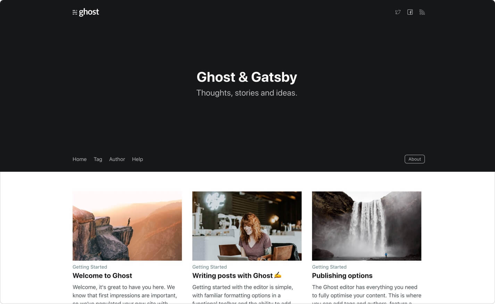

[Ghost](https://ghost.org) é uma plataforma de publicação profissional, _open source_, construída em cima de uma moderna tecnologia Node.js - projetada para times que precisam de poder, flexibilidade e performance - utilizada pela Apple, NASA, Sky News, OpenAI e muitas outras.

Ela vem com todos os benefícios de uma plataforma _Headless CMS_ morderna e centraliza, com o benefício adicional de ser totalmente gratuita sob a licença do MIT, para que você tenha o total controle, sem precisar depender de um _back-end_ de terceiros.

Esse guia irá orientar você sobre o uso de [Gatsby](/) com a [API de Conteúdo do Ghost](https://docs.ghost.org/api/content/).

&nbsp;

---

## Início Rápido

O jeito mais rápido de começar é com o repositório oficial **Gatsby Starter Ghost**, no qual contém um leve andaime de consultas e _templates_ para se ter um _site_ em funcionamento.


- Repositório: https://github.com/tryghost/gatsby-starter-ghost
- Demo: https://gatsby.ghost.org

[](https://gatsby.ghost.org)

&nbsp;

---

## Instalação e Configuração

Se você prefere iniciar do zero ou integrar o conteúdo da API do Ghost em um _site_ existente, você pode configurar o plugin **Gastby Source Ghost**.

```shell
npm install --save gatsby-source-ghost
```

### Configuração

```javascript:title=gatsby-config.js
// Essas sao credenciais de demonstracao que funcionam, experimentem!

module.exports = {
  plugins: [
    {
      resolve: `gatsby-source-ghost`,
      options: {
        apiUrl: `https://gatsby.ghost.io`,
        contentApiKey: `9cc5c67c358edfdd81455149d0`,
      },
    },
  ],
}
```

&nbsp;

---

## Gerando páginas

Uma vez que o plugins nativo é configurado, você pode usar a API `createPages` em `gatsby-node.js` para criar consultas nos seus dados do Ghost com GraphQL. Nesse exemplo, Gatsby itera sobre cada postagem retornada pela API do Ghost e gera uma nova página com esses dados, usando o arquivo de modelo `post.js`.

Existem vários modos de estruturar as consultas dependendo de como você prefere trabalhar, mas aqui está um pequeno exemplo:

```javascript:title=gatsby-node.js
const path = require(`path`)

exports.createPages = async ({ graphql, actions, reporter }) => {
  const { createPage } = actions
  const postTemplate = path.resolve(`./src/templates/post.js`)

  // Consultar dados do Ghost
  const result = await graphql(`
    {
      allGhostPost(sort: { order: ASC, fields: published_at }) {
        edges {
          node {
            slug
          }
        }
      }
    }
  `)

  // Manipulador de error
  if (result.errors) {
    reporter.panicOnBuild(`Error while running GraphQL query.`)
    return
  }

  if (!result.data.allGhostPost) {
    return
  }

  // Criar paginas para cada postagem do Ghost
  const items = result.data.allGhostPost.edges
  items.forEach(({ node }) => {
    node.url = `/${node.slug}/`

    createPage({
      path: node.url,
      component: path.resolve(postTemplate),
      context: {
        slug: node.slug,
      },
    })
  })
}
```

&nbsp;

---

## Saída de dados

Em seguida, dentro do modelo `post.js`, você pode determinar exatamente como e onde você quer a saída de dados em cada página. Novamente, você vai utilizar GraphQL para consultar campos individuais. Um simples exemplo seria como esse:

```javascript:title=templates/post.js
import React from "react"
import { graphql } from "gatsby"

const Post = ({ data }) => {
  const post = data.ghostPost
  return (
    <>
      <article className="post">
        {post.feature_image ? (
          
        ) : null}
        <h1>{post.title}</h1>
        <section dangerouslySetInnerHTML={{ __html: post.html }} />
      </article>
    </>
  )
}

export default Post

export const postQuery = graphql`
  query($slug: String!) {
    ghostPost(slug: { eq: $slug }) {
      id
      title
      slug
      feature_image
    }
  }
`
```

&nbsp;

---

## Empacotamento

Você deve ter um amplo entendimento de como o Gatsby e a API de conteúdo do Ghost trabalham juntos agora para usar Ghost como um _Headless CMS_. Seus escritores podem aproveitar a excelente experiência de administração, enquanto o seu time de desenvolvimento pode continuar usando sua ferramenta ideal. Todo mundo ganha!

### O que ler depois

Aqui estão alguns recursos adicionais e materiais de leitura para ajudar você a começar com alguns exemplos e casos de uso mais avançados:

- [Postagem de anúncio do Gatsby + Ghost](/blog/2019-01-14-modern-publications-with-gatsby-ghost/)
- [Mais informações sobre Ghost como um Headless CMS](https://blog.ghost.org/jamstack/)
- [Gatsby starter oficial para Ghost](https://github.com/tryghost/gatsby-starter-ghost)
- [Plugin nativo Gatsby oficial para Ghost](/packages/gatsby-source-ghost/)
- [Documentação de desenvolvimento oficial do Ghost](https://docs.ghost.org/api/)
