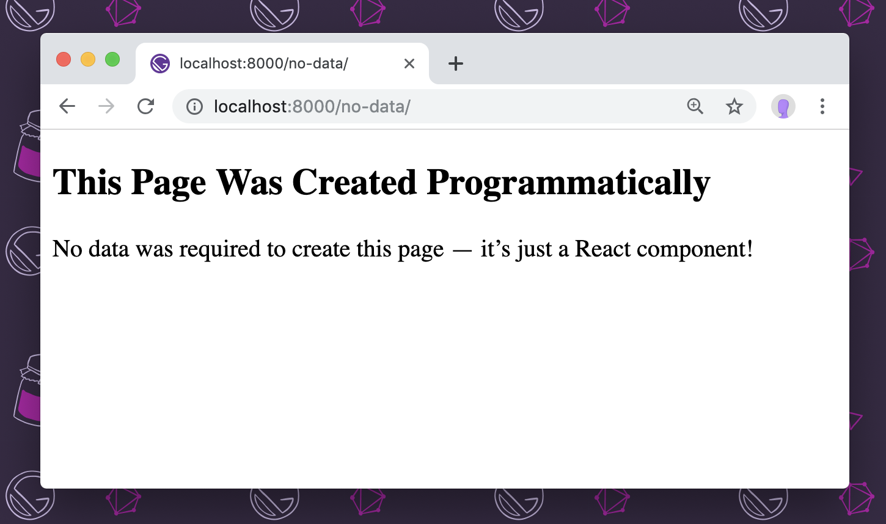
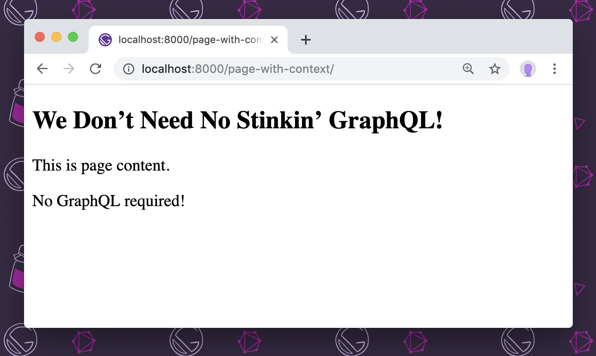
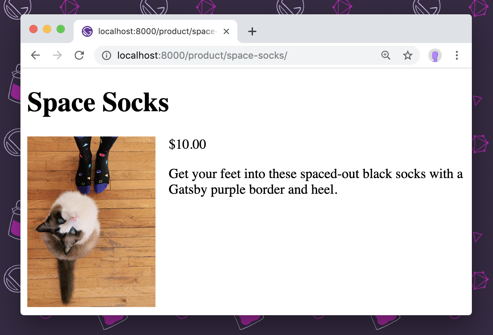
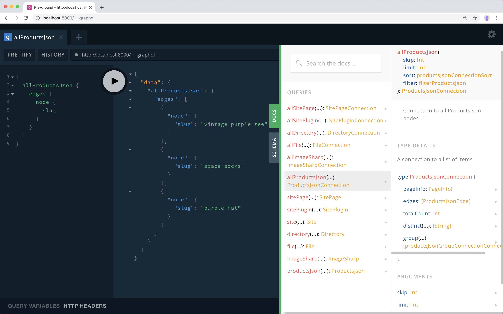
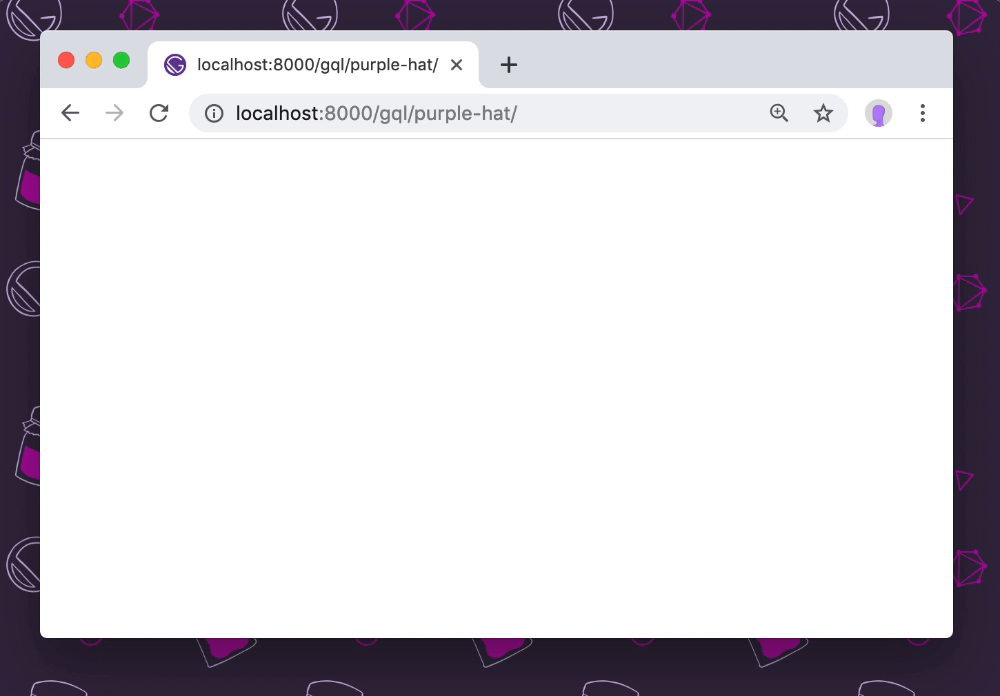

Uma pergunta comum sobre Gatsby é: “Por que Gatsby usa GraphQL? Ele não gera arquivos estáticos?”

Sem fornecer algum contexto, o GraphQL pode parecer um exagero para algo como Gatsby. Ao longo do texto, você verá quais problemas surgem ao criar páginas, e como esses problemas podem ser resolvidos usando GraphQL.

## Criar uma página sem quaisquer dados

<EggheadEmbed
  lessonLink="https://egghead.io/lessons/gatsby-create-a-gatsby-page-without-any-data"
  lessonTitle="Create a Gatsby Page Without Any Data"
/>

Para qualquer tipo de página que não seja diretamente criada em `src/pages/`, você precisará do Gatsby [`createPages` Node API](/docs/node-apis/#createPages) para criar páginas de forma dinâmica.

Tudo que é necessário para criar uma página é um `path` onde ela deve ser criada e o componente que deve ser renderizado nela.

Por exemplo, se você tivesse o seguinte componente:

```jsx:title=src/templates/no-data.js
import React from "react"

const NoData = () => (
  <section>
    <h1>This Page Was Created Programmatically</h1>
    <p>
      No data was required to create this page — it’s just a React component!
    </p>
  </section>
)

export default NoData
```

Você poderia criar uma página dinâmica em `/no-data/` acrescentando o seguinte em `gatsby-node.js`:

```js:title=gatsby-node.js
exports.createPages = ({ actions: { createPage } }) => {
  createPage({
    path: "/no-data/",
    component: require.resolve("./src/templates/no-data.js"),
  })
}
```

<<<<<<< HEAD
Depois de executar `gatsby develop`, você verá o seguinte em `localhost:8000/no-data/`:
=======
After running `gatsby develop`, you’ll see the following at `http://localhost:8000/no-data/`:
>>>>>>> 22a3fb4d3155774ddc223a249897020b0ee18db1



Nos casos mais simples, isto é tudo o que é necessário para construir páginas com o Gatsby. No entanto, muitas vezes você vai querer passar dados para a página para que o componente modelo seja reutilizável.

## Criar uma página com dados codificados

<EggheadEmbed
  lessonLink="https://egghead.io/lessons/gatsby-create-a-gatsby-page-with-hard-coded-data"
  lessonTitle="Create a Gatsby Page With Hard-Coded Data"
/>

Para passar dados para as páginas criadas, você precisará passar o `context` para a chamada `createPage`.

<<<<<<< HEAD
Em `gatsby-node.js`, podemos adicionar um contexto como esse:
=======
In `gatsby-node.js`, you can add context like so:
>>>>>>> 22a3fb4d3155774ddc223a249897020b0ee18db1

```js:title=gatsby-node.js
exports.createPages = ({ actions: { createPage } }) => {
  createPage({
    path: "/page-with-context/",
    component: require.resolve("./src/templates/with-context.js"),
    context: {
      title: "We Don’t Need No Stinkin’ GraphQL!",
      content: "<p>This is page content.</p><p>No GraphQL required!</p>",
    },
  })
}
```

<<<<<<< HEAD
A propriedade `context` aceita um objeto, e podemos passar qualquer dado que queremos que a página seja capaz de acessar.
=======
The `context` property accepts an object, and you can pass in any data you want the page to be able to access.
>>>>>>> 22a3fb4d3155774ddc223a249897020b0ee18db1

> **NOTA:** Existem alguns nomes reservados que _não podem_ ser usados em `context`. Eles são: `path`, `matchPath`, `component`, `componentChunkName`, `pluginCreator___NODE` e `pluginCreatorId`.

<<<<<<< HEAD
Quando Gatsby cria páginas, ele inclui uma propriedade chamada `pageContext` e define o seu valor para `context`, para que possamos acessar qualquer um dos valores em nosso componente:
=======
When Gatsby creates pages, it includes a prop called `pageContext` and sets its value to `context`, so you can access any of the values in your component:
>>>>>>> 22a3fb4d3155774ddc223a249897020b0ee18db1

```jsx:title=src/templates/with-context.js
import React from "react"

const WithContext = ({ pageContext }) => (
  <section>
    <h1>{pageContext.title}</h1>
    <div dangerouslySetInnerHTML={{ __html: pageContext.content }} />
  </section>
)

export default WithContext
```

<<<<<<< HEAD
Inicie o servidor de desenvolvimento com `gatsby develop` e visite `localhost:8000/page-with-context/` para ver a página criada:
=======
Start the development server with `gatsby develop` and visit `http://localhost:8000/page-with-context/` to see the created page:
>>>>>>> 22a3fb4d3155774ddc223a249897020b0ee18db1



Em alguns casos, essa abordagem pode ser suficiente. No entanto, muitas vezes é necessário criar páginas a partir dos dados que não podem ser codificados.

## Criar páginas a partir do JSON com imagens

<EggheadEmbed
  lessonLink="https://egghead.io/lessons/gatsby-create-pages-from-json-with-images"
  lessonTitle="Create Pages from JSON With Images"
/>

Em muitos casos, os dados das páginas não podem ser codificado em `gatsby-node.js`. É mais provável que venham de uma fonte externa, como uma API de terceiros, um Markdown local ou arquivos JSON.

Por exemplo, você pode ter um arquivo JSON com dados de postagem:

```json:title=data/products.json
[
  {
    "title": "Vintage Purple Tee",
    "slug": "vintage-purple-tee",
    "description": "<p>Keep it simple with this vintage purple tee.</p>",
    "price": "$10.00",
    "image": "/images/amberley-romo-riggins.jpg"
  },
  {
    "title": "Space Socks",
    "slug": "space-socks",
    "description": "<p>Get your feet into these spaced-out black socks with a Gatsby purple border and heel.</p>",
    "price": "$10.00",
    "image": "/images/erin-fox-and-sullivan.jpg"
  },
  {
    "title": "This Purple Hat Is Blazing Fast",
    "slug": "purple-hat",
    "description": "<p>Add more blazingly blazing speed to your wardrobe with this solid purple laundered chino twill hat.</p>",
    "price": "$10.00",
    "image": "/images/david-bailey-cat-hat.jpg"
  }
]
```

As imagens precisam ser adicionadas à pasta `/static/images/`. (É aqui que as coisas começam a ficar difíceis de gerir — o JSON e as imagens não estão no mesmo lugar).

Uma vez que o JSON e as imagens são adicionados, você pode criar páginas de produtos importando o JSON em `gatsby-node.js` e fazer um loop através das entradas para criar páginas:

```js:title=gatsby-node.js
exports.createPages = ({ actions: { createPage } }) => {
  const products = require("./data/products.json")
  products.forEach(product => {
    createPage({
      path: `/product/${product.slug}/`,
      component: require.resolve("./src/templates/product.js"),
      context: {
        title: product.title,
        description: product.description,
        image: product.image,
        price: product.price,
      },
    })
  })
}
```

O modelo de produto ainda utiliza o `pageContext` para exibir os dados do produto:

```jsx:title=src/templates/product.js
import React from "react"

const Product = ({ pageContext }) => (
  <div>
    <h1>{pageContext.title}</h1>
    
    <p>{pageContext.price}</p>
    <div dangerouslySetInnerHTML={{ __html: pageContext.description }} />
  </div>
)

export default Product
```

<<<<<<< HEAD
Execute `gatsby develop`, depois abra `localhost:8000/product/space-socks/` para ver um dos produtos gerados.
=======
Run `gatsby develop`, then open `http://localhost:8000/product/space-socks/` to see one of the generated products.
>>>>>>> 22a3fb4d3155774ddc223a249897020b0ee18db1



Isto faz o trabalho, mas tem algumas falhas que vão ficando mais complicadas com o passar do tempo:

1. As imagens e os dados do produto estão em diferentes lugares no código fonte.
2. Os caminhos da imagem são absolutos do _site construído_, não do código fonte, o que torna confuso saber como encontrá-los a partir do JSON.
3. As imagens não são otimizadas, e qualquer otimização que você fizer teria que ser manual.
4. Para criar uma listagem prévia de todos os produtos, precisaríamos passar _todas_ as informações do produto em `context`, o que ficaria complicado à medida que o número de produtos aumenta.
5. Não é muito óbvio de onde os dados vêm nos modelos que renderizam as páginas, portanto, atualizar os dados pode ser confuso mais tarde.

Para ultrapassar essas limitações, Gatsby introduz GraphQL como uma camada de gestão de dados.

## Criar páginas usando GraphQL

Há um pouco mais de configuração inicial necessária para obter dados no GraphQL, mas os benefícios superam (e muito) o custo.

Usando `data/products.json` como exemplo, somos capazes de resolver todas as limitações da seção anterior usando GraphQL:

1. As imagens podem ser colocadas com os produtos em `data/images/`.
2. Os caminhos da imagem em `data/products.json` podem ser relativas ao arquivo JSON.
3. Gatsby pode otimizar automaticamente as imagens para um carregamento mais rápido e para uma melhor experiência de usuário.
4. Você não precisa mais passar todos os dados do produto para o `context` quando criar páginas.
5. Os dados são carregados usando GraphQL nos componentes onde são usados, tornando muito mais fácil ver de onde os dados vêm e como alterá-los.

### Adicione os plugins necessários para carregar os dados no GraphQL

<EggheadEmbed
  lessonLink="https://egghead.io/lessons/gatsby-make-data-queryable-in-graphql-with-gatsby"
  lessonTitle="Make Data Queryable in GraphQL With Gatsby"
/>

A fim de carregar os dados do produto e da imagem no GraphQL, você precisa adicionar alguns [plugins Gatsby](/plugins/). Nomeadamente, você precisa de plugins para:

- Carregar o arquivo JSON no armazenamento de dados internos do Gatsby, que pode ser consultado usando GraphQL ([`gatsby-source-filesystem`](/packages/gatsby-source-filesystem/))
- Converter arquivos JSON em um formato que você pode consultar usando GraphQL ([`gatsby-transformer-json`](/packages/gatsby-transformer-json/))
- Otimizar imagens ([`gatsby-plugin-sharp`](/packages/gatsby-plugin-sharp/))
- Adicionar dados sobre imagens otimizadas ao armazenamento de dados do Gatsby ([`gatsby-transformer-sharp`](/packages/gatsby-transformer-sharp/))

Além dos plugins, utilizaremos [`gatsby-image`](/packages/gatsby-image/) para exibir as imagens otimizadas com lazy loading.

Instale esses pacotes usando a linha de comando:

```shell
npm install --save gatsby-source-filesystem gatsby-transformer-json gatsby-plugin-sharp gatsby-transformer-sharp gatsby-image
```

Depois adicione-os ao `gatsby-config.js`:

```js:title=gatsby-config.js
module.exports = {
  plugins: [
    {
      resolve: "gatsby-source-filesystem",
      options: {
        path: "./data/",
      },
    },
    "gatsby-transformer-json",
    "gatsby-transformer-sharp",
    "gatsby-plugin-sharp",
  ],
}
```

Para checar se isso funcionou, você pode usar o GraphQL Playground, que está disponível durante o desenvolvimento, executando:

```shell
GATSBY_GRAPHQL_IDE=playground gatsby develop
```

> **NOTA:** A parte `GATSBY_GRAPHQL_IDE=playground` deste comando é opcional. Ele ativa o GraphQL Playground em vez do GraphiQL, que é uma interface mais antiga para explorar o GraphQL.

Você pode explorar o esquema de dados disponíveis usando o separador “Docs” à direita.

Uma das opções disponíveis é `allProductsJson`, que contém “edges”, estes contendo “nodes”.

O plugin _JSON transformer_ criou um node para cada produto, e dentro do node você pode selecionar os dados que você precisa para aquele produto.

Você pode escrever uma consulta para selecionar o slug de cada produto, desta forma:

```graphql
{
  allProductsJson {
    edges {
      node {
        slug
      }
    }
  }
}
```

Teste esta consulta inserindo-a no painel esquerdo do GraphQL Playground, depois pressione o botão play no centro superior.

Os resultados aparecerão no painel entre a consulta e os documentos, parecido com isso:



### Gerar páginas com GraphQL

<EggheadEmbed
  lessonLink="https://egghead.io/lessons/gatsby-create-pages-in-gatsby-using-graphql"
  lessonTitle="Create Pages in Gatsby Using GraphQL"
/>

Em `gatsby-node.js`, você pode usar a consulta GraphQL que você acabou de escrever para gerar páginas.

```js:title=gatsby-node.js
exports.createPages = async ({ actions: { createPage }, graphql }) => {
  const results = await graphql(`
    {
      allProductsJson {
        edges {
          node {
            slug
          }
        }
      }
    }
  `)

  results.data.allProductsJson.edges.forEach(edge => {
    const product = edge.node

    createPage({
      path: `/gql/${product.slug}/`,
      component: require.resolve("./src/templates/product-graphql.js"),
      context: {
        slug: product.slug,
      },
    })
  })
}
```

Você precisa usar o helper `graphql` que está disponível em [`createPages` Node API](/docs/node-apis/#createPages) para executar a consulta. Para garantir que o resultado da consulta volte antes de continuar, utilize [`async`/`await`](https://developer.mozilla.org/en-US/docs/Web/JavaScript/Reference/Statements/async_function).

Os resultados que voltam são muito semelhantes ao conteúdo do `data/products.json`, assim você pode fazer um loop através dos resultados e criar uma página para cada um.

No entanto, note que você está apenas passando a `slug` em `context` — você vai utilizar isso no componente modelo para carregar mais dados do produto.

Como você já viu, o argumento `context` é disponibilizado para componente modelo na propriedade `pageContext`. Para tornar as consultas mais poderosas, Gatsby _também_ expõe tudo em `context` como uma variável GraphQL, o que significa que vocẽ pode escrever uma consulta que diz, em Português simples, "Carregue dados para o produto com a slug passada em `context`.”

Aqui está o que isso se parece na prática:

```jsx:title=src/templates/product-graphql.js
import React from "react"
import { graphql } from "gatsby"
import Image from "gatsby-image"

export const query = graphql`
  query($slug: String!) {
    productsJson(slug: { eq: $slug }) {
      title
      description
      price
      image {
        childImageSharp {
          fluid {
            ...GatsbyImageSharpFluid
          }
        }
      }
    }
  }
`

const Product = ({ data }) => {
  const product = data.productsJson

  return (
    <div>
      <h1>{product.title}</h1>
      <Image
        fluid={product.image.childImageSharp.fluid}
        alt={product.title}
        style={{ float: "left", marginRight: "1rem", width: 150 }}
      />
      <p>{product.price}</p>
      <div dangerouslySetInnerHTML={{ __html: product.description }} />
    </div>
  )
}

export default Product
```

Algumas notas sobre este arquivo:

1. O resultado da consulta é adicionado ao componente modelo como a propriedade `data`.
2. O caminho da imagem foi automaticamente convertido pelo transformador _Sharp_ em um "nó filho" que inclui versões otimizadas da imagem.
3. A consulta usa um [fragmento de GraphQL](/packages/gatsby-image/#fragments) para consultar todos os dados necessários para imagens otimizadas. Fragmentos de GraphQL _não funcionam_ no Playground GraphQL.
4. A tag `img` foi trocada por um componente `gatsby-image` chamado `Image`. Ao invés de um atributo `src`, ele aceita um objeto com dados da imagem otimizados.

<<<<<<< HEAD
Salve esse arquivo, execute `gatsby develop`, e depois abra `localhost:8000/gql/purple-hat/`:
=======
Save this file, run `gatsby develop`, then open `http://localhost:8000/gql/purple-hat/`:
>>>>>>> 22a3fb4d3155774ddc223a249897020b0ee18db1



A imagem agora está otimizada e carregada de maneira _lazy_

Após a configuração inicial, o carregamento de dados com GraphQL é bastante semelhante ao carregamento direto de JSON, mas oferece benefícios extras como a otimização automática das imagens e a manutenção do carregamento de dados no mesmo local onde é utilizado.

GraphQL certamente não é necessário, mas os benefícios da adoção dele são significativos. GraphQL irá simplificar o processo de construção e de otimização de suas páginas, por isso é considerado uma boa prática para estruturar e escrever aplicações Gatsby.
